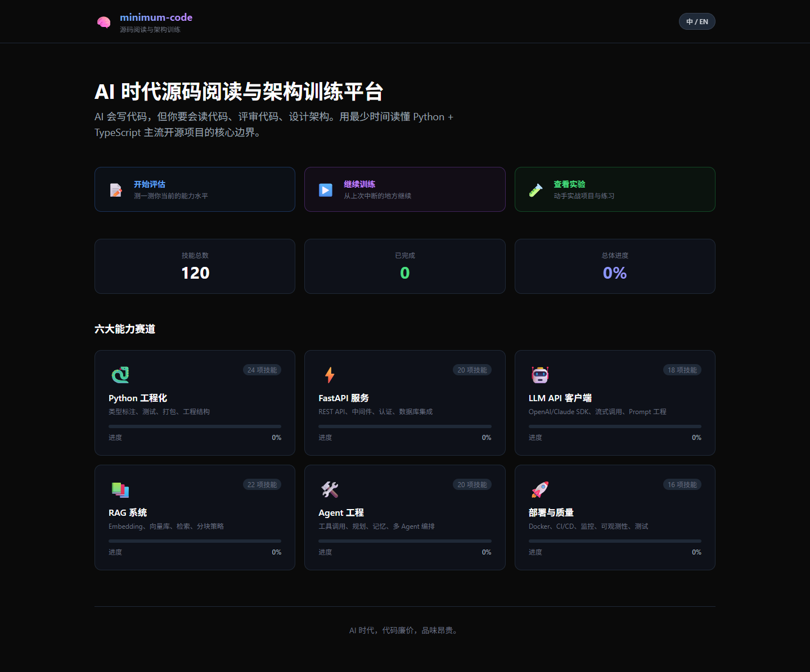
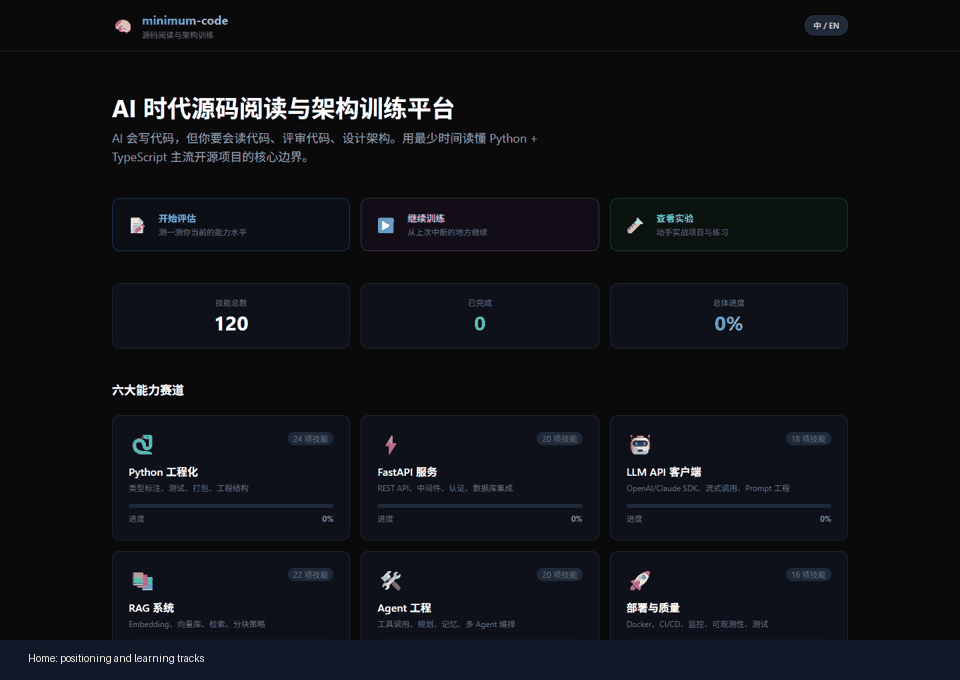

# minimum-code

面向 AI 时代开发者的源码阅读与架构训练平台。

AI can write code, but you still need to read code, review tradeoffs, and design architecture. `minimum-code` helps developers understand the core architecture, design patterns, and engineering boundaries of mainstream Python + TypeScript projects in less time.

[Live Demo](#live-demo) | [Docs](docs) | [Roadmap](ROADMAP.md) | [Contributing](CONTRIBUTING.md)





[](LICENSE)
[](https://python.org)
[](https://typescriptlang.org)
[](https://nextjs.org)
[](https://fastapi.tiangolo.com)

## Why This Exists

Most AI coding tutorials teach isolated API calls. Real engineering work asks different questions:

- Can you read an unfamiliar codebase quickly?
- Can you explain why a framework boundary exists?
- Can you review AI-generated code for hidden bugs and architecture drift?
- Can you build the smallest reliable implementation and prove it works?

`minimum-code` focuses on that layer: source-code reading, pattern recognition, practical system design, and test-backed engineering judgment.

> AI lowers the cost of writing code. It does not remove the need to understand code.

## Product Positioning

`minimum-code` is not a "learn every syntax feature" course. It is a source-code reading and architecture training platform for developers who want to build better judgment in the AI era.

The current content is organized around:

- 892 structured learning points
- 4 interactive exercise types
- 10 source-code reading modules
- Frontend + backend tests included
- JSON-backed content so the project can run without a database

The main training hook is:

**AI 会写代码，但你要会读代码、评审代码、设计架构。**

## Who This Is For

| Audience | What they get |
| --- | --- |
| AI application beginners | A bridge from API calls to maintainable services |
| Career switchers | Practical architecture vocabulary and verified labs |
| Developers who can call APIs but lack system design practice | Source-reading reps across FastAPI, LangChain, Next.js, tRPC, Tauri, and related projects |
| Interview candidates | Concrete project narratives backed by tests and code |

## Training Loop

Every module follows a practical loop:

```text
1. Read a minimal source slice
2. Identify the architecture boundary
3. Extract the reusable pattern
4. Complete an interactive exercise
5. Verify with tests or data validation
6. Explain the tradeoff in interview language
```

## Source-Reading Modules

| Area | Modules |
| --- | --- |
| Python architecture | FastAPI, LangChain, CrewAI, Dify, RAGFlow |
| TypeScript architecture | Next.js, tRPC, Tauri, shadcn/ui, Bun |
| Shared design patterns | Dependency injection, middleware, builder, strategy, observer, factory, repository, pipeline |
| AI engineering practice | Prompt engineering, AI-assisted architecture, AI code review, AI-driven development |

## Killer Path

The first path to polish is:

```text
7 days to understand Agent engineering source code:
LangChain + FastAPI + multi-agent workflow patterns
```

This keeps the product focused on a memorable promise instead of expanding into a broad "learn all programming" course.

## Live Demo

An online demo is planned in the roadmap. Until the hosted URL is available, run the local demo:

```bash
git clone https://github.com/oooooowoooooo/minimum-code.git
cd minimum-code
```

Start the backend:

```bash
cd web/backend
pip install -r requirements.txt
uvicorn main:app --reload --port 8000
```

Start the frontend in a second terminal:

```bash
cd web
npm install
npm run dev
```

Open `http://localhost:3000`.

## Run Verification

Frontend:

```bash
cd web
npm test
```

Backend:

```bash
cd web/backend
pip install -r requirements.txt
pytest -v
```

Data integrity:

```bash
cd web/backend
python verify_all.py
```

GitHub Actions runs these checks on pushes and pull requests to `main`.

## Project Structure

```text
minimum-code/
├── .github/
│   ├── ISSUE_TEMPLATE/            # Contribution entry points
│   └── workflows/ci.yml           # Frontend, backend, and data verification
├── docs/                          # Guides, roadmap, and product assets
├── labs/                          # Runnable engineering labs
├── src/
│   ├── patterns/                  # Shared architecture patterns
│   ├── python/                    # Python fundamentals + project dissections
│   └── typescript/                # TypeScript fundamentals + project dissections
├── tests/                         # Root Python and TypeScript tests
└── web/
    ├── app/                       # Next.js app router frontend
    ├── components/                # UI and interactive exercise components
    ├── lib/                       # Frontend data and API helpers
    └── backend/
        ├── app/
        │   ├── api/               # FastAPI routes
        │   ├── core/              # Paths and config
        │   ├── repositories/      # JSON persistence
        │   ├── schemas/           # Pydantic models
        │   └── services/          # Module, quiz, extraction, and data services
        ├── data/                  # Knowledge points, modules, quizzes, tracks
        └── verify_all.py          # Data verification
```

## Architecture

```text
Next.js frontend
      |
      | HTTP / JSON
      v
FastAPI route layer
      |
      v
Service layer
      |
      v
JSON repository
```

The backend deliberately stays database-free for now. That keeps cloning, testing, and contribution lightweight while the product positioning and learning path mature.

## Repository Topics

Recommended GitHub topics:

```text
ai-education
programming-education
source-code-reading
software-architecture
python
typescript
nextjs
fastapi
interactive-learning
ai-coding
code-quality
learning-platform
```

GitHub topics are repository settings, not files in the codebase. Add them from the repository page or with `gh repo edit --add-topic ...`.

## Contributing

Good first contributions include:

- Add a knowledge point
- Fix or improve a quiz
- Add a source-code dissection card
- Add a focused module search test
- Improve the demo screenshot or GIF
- Polish the Agent engineering path

See [CONTRIBUTING.md](CONTRIBUTING.md) and [Good First Issues](docs/GOOD_FIRST_ISSUES.md).

## License

[MIT](LICENSE)
